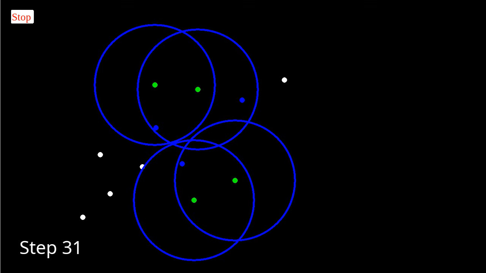

# MeshtasticSim

A library for simulating a [Meshtastic](https://meshtastic.org/)-like mesh network in Python.

This library is made for testing mesh algorithms in various conditions.

## Dependencies

The base simulator does not have any dependencies, but the GUI requires `pyglet` (`pip install pyglet`).

## Usage

Clone this repository and take a look at the `examples` folder for usage examples.

## Examples

The `examples/mesh_alg` contains an implementation of Meshtastic's mesh algorithm, explained [here](https://meshtastic.org/docs/overview/mesh-algo/).

To run it,
1. Add the library to the current `$PYTHONPATH` (`export PYTHONPATH=$PYTHONPATH:$PWD` on linux)
2. Run `examples/mesh_alg/main_graphical.py` / `examples/mesh/alg/main_automated.py` from the project root directory.
3. In the graphical UI, you can add nodes and then press start to start sending a message from the first node to the last node placed.

## License

This project is licensed under the MIT License - see the [LICENSE](LICENSE) file for details.

Meshtastic® is a registered trademark of Meshtastic LLC.
This project is not affiliated with or endorsed by Meshtastic LLC.
